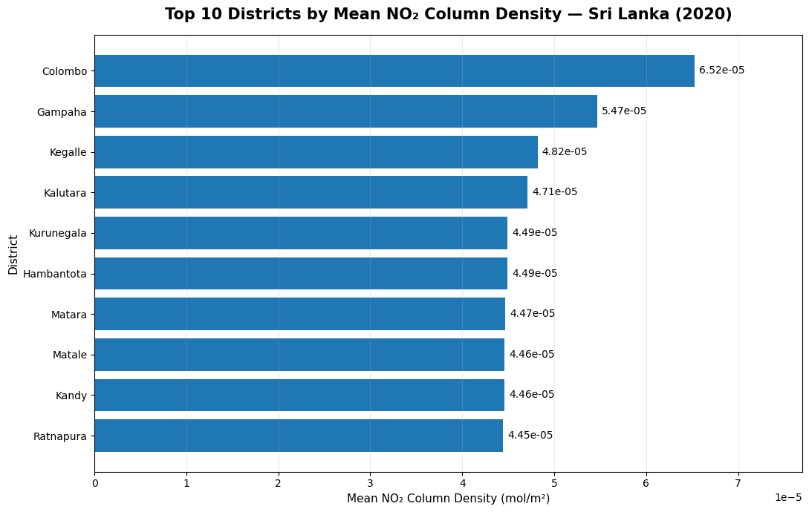
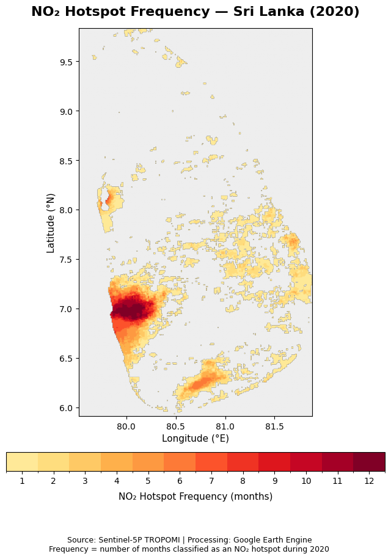
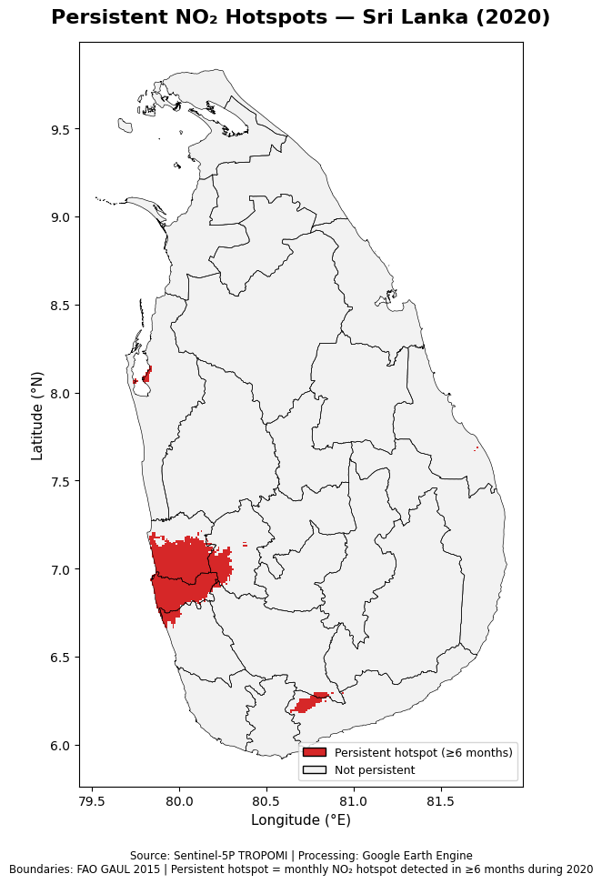

# Sri-Lanka-NO2-EO-Intelligence-Analysis
Earth observation intelligence analysis of NO₂ patterns over Sri Lanka using Sentinel-5P and Google Earth Engine, including hotspot detection, temporal trends, persistence analysis, district-level assessment, and OSINT interpretation.

# Sri Lanka NO₂ Earth Observation Intelligence Analysis

## Sentinel-5P / Google Earth Engine Air Quality Analysis — 2020

An Earth observation project investigating the spatial and temporal distribution of tropospheric nitrogen dioxide (NO₂) over Sri Lanka using Sentinel-5P satellite observations and Google Earth Engine.

The analysis focuses on identifying persistent NO₂ hotspot patterns during 2020 and quantifying hotspot coverage at the district level.

### Key Objectives

- Analyze the spatial distribution of Sentinel-5P tropospheric NO₂ over Sri Lanka.
- Identify recurring monthly NO₂ hotspots during 2020.
- Detect persistent hotspots occurring for at least 6 months.
- Quantify persistent hotspot area and percentage coverage by district.
- Rank districts according to persistent hotspot coverage.
- Produce reproducible geospatial outputs, district-level statistics, and portfolio-ready visualizations.

## Key Result

### Persistent NO2 Hotspot Coverage 

Persistent hotspot coverage shows a strong spatial concentration in selected districts. Colombo recorded the highest district-level coverage (approximately 93.6%), followed by Gampaha (approximately 59.5%) and Kegalle (approximately 14.3%).

> **Note:** Persistent hotspot coverage refers to areas meeting the project's ≥6-month hotspot persistence criterion. It should not be interpreted directly as a measure of ground-level NO₂ concentration or overall air-quality exposure.

### District Mean NO₂ Column Density

The district-level analysis shows clear spatial differences in mean tropospheric NO₂ column density across Sri Lanka during 2020. Colombo recorded the highest district mean NO₂ column density (approximately 6.52 × 10⁻⁵ mol/m²), followed by Gampaha (approximately 5.47 × 10⁻⁵ mol/m²).

The ranking indicates that the strongest mean NO₂ signal was concentrated in the Western Province, particularly around the Colombo metropolitan region. Kegalle and Kalutara followed, while the remaining districts in the top ten showed comparatively similar mean NO₂ levels.

Mean NO₂ column density and persistent hotspot coverage provide complementary information: mean column density describes the overall NO₂ level observed across a district, whereas hotspot coverage identifies the spatial extent of locations experiencing recurrent elevated NO₂ conditions.

### District Mean Tropospheric NO₂ — 2020

The district-level annual mean NO₂ distribution shows clear spatial variation across Sri Lanka. Higher mean tropospheric NO₂ column densities are concentrated in parts of western Sri Lanka, while comparatively lower values dominate much of the central, eastern, and northern regions.

This spatial pattern complements the persistent-hotspot analysis by distinguishing overall annual mean NO₂ levels from areas where elevated NO₂ conditions repeatedly occurred throughout the year.

> **Note:** Values represent Sentinel-5P TROPOMI tropospheric NO₂ column density aggregated to the district level. The map represents satellite-derived atmospheric column measurements and should not be interpreted directly as ground-level NO₂ concentrations.
>

## NO₂ Hotspot Frequency — 2020

The hotspot-frequency analysis shows how consistently elevated tropospheric NO₂ conditions occurred across Sri Lanka during 2020. Each pixel represents the number of months in which it was classified as an NO₂ hotspot, ranging from 1 to 12 months.

The strongest temporal persistence is concentrated in western Sri Lanka, particularly around the Colombo metropolitan region, where some locations were identified as hotspots during most or all months of the year. More localized recurring hotspots are also visible in other parts of the country.

This frequency-based analysis distinguishes persistent NO₂ patterns from short-term or isolated monthly anomalies and provides a temporal dimension to the spatial hotspot assessment.

> **Note:** Hotspot frequency represents the number of monthly observations meeting the project's hotspot criterion. It should not be interpreted directly as ground-level NO₂ concentration or population exposure.

### Persistent NO₂ Hotspots

Persistent hotspots were defined as locations classified as monthly NO₂ hotspots in at least 6 months during 2020. The results show a strong concentration of persistent hotspot activity in western Sri Lanka, with additional localized areas elsewhere in the country.

District boundaries are shown using FAO GAUL 2015 administrative boundaries to provide geographic context.

> **Note:** The hotspot classification is based on Sentinel-5P TROPOMI tropospheric NO₂ column density and represents satellite-derived atmospheric column measurements rather than direct ground-level NO₂ concentrations.
