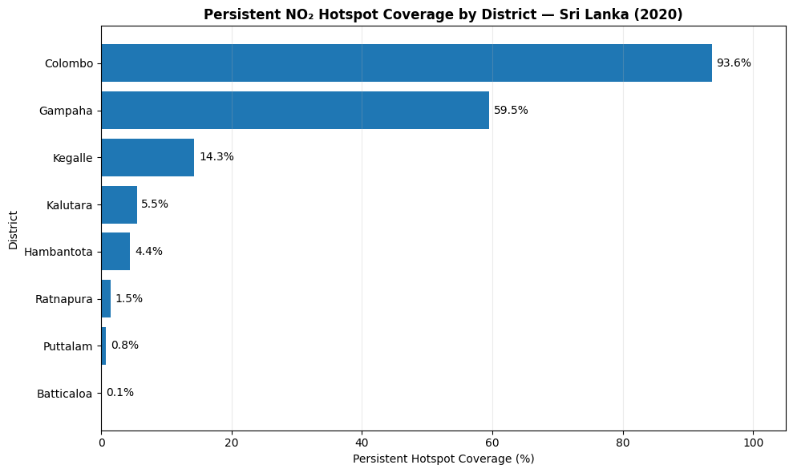
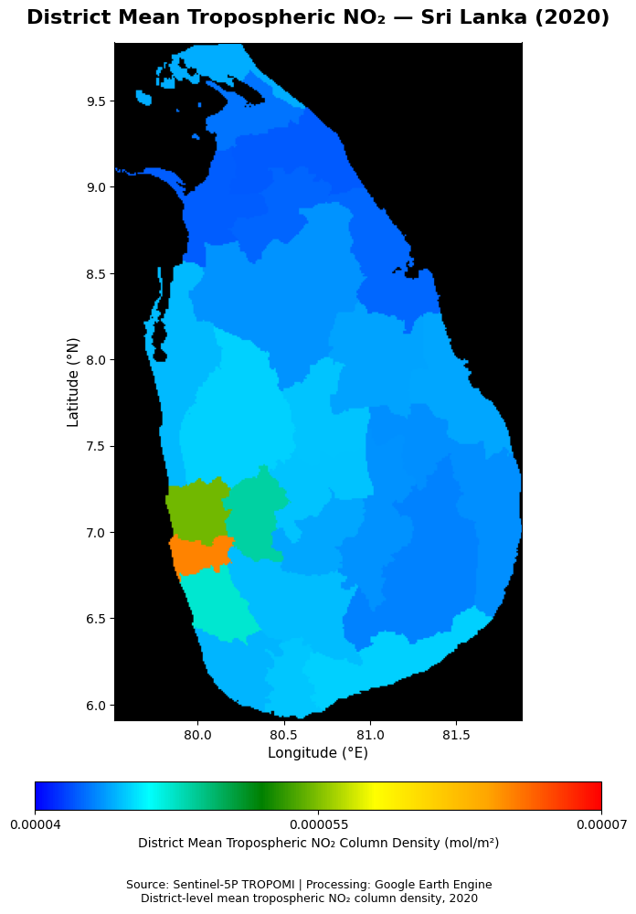

# Sri-Lanka-NO2-EO-Intelligence-Analysis
Earth observation intelligence analysis of NO₂ patterns over Sri Lanka using Sentinel-5P and Google Earth Engine, including hotspot detection, temporal trends, persistence analysis, district-level assessment, and OSINT interpretation.

# Sri Lanka NO₂ Earth Observation Intelligence Analysis

## Sentinel-5P / Google Earth Engine Air Quality Analysis — 2020

An Earth observation project investigating the spatial and temporal distribution of tropospheric nitrogen dioxide (NO₂) over Sri Lanka using Sentinel-5P satellite observations and Google Earth Engine.

The analysis focuses on identifying persistent NO₂ hotspot patterns during 2020 and quantifying hotspot coverage at the district level.

### Key Objectives

- Analyze the spatial distribution of Sentinel-5P tropospheric NO₂ over Sri Lanka.
- Identify recurring monthly NO₂ hotspots during 2020.
- Detect persistent hotspots occurring for at least 6 months.
- Quantify persistent hotspot area and percentage coverage by district.
- Rank districts according to persistent hotspot coverage.
- Produce reproducible geospatial outputs, district-level statistics, and portfolio-ready visualizations.

## Key Result

Persistent hotspot coverage shows a strong spatial concentration in selected districts. Colombo recorded the highest district-level coverage (approximately 93.6%), followed by Gampaha (approximately 59.5%) and Kegalle (approximately 14.3%).

> **Note:** Persistent hotspot coverage refers to areas meeting the project's ≥6-month hotspot persistence criterion. It should not be interpreted directly as a measure of ground-level NO₂ concentration or overall air-quality exposure.

### District Mean Tropospheric NO₂ — 2020

The district-level annual mean NO₂ distribution shows clear spatial variation across Sri Lanka. Higher mean tropospheric NO₂ column densities are concentrated in parts of western Sri Lanka, while comparatively lower values dominate much of the central, eastern, and northern regions.

This spatial pattern complements the persistent-hotspot analysis by distinguishing overall annual mean NO₂ levels from areas where elevated NO₂ conditions repeatedly occurred throughout the year.

> **Note:** Values represent Sentinel-5P TROPOMI tropospheric NO₂ column density aggregated to the district level. The map represents satellite-derived atmospheric column measurements and should not be interpreted directly as ground-level NO₂ concentrations.
